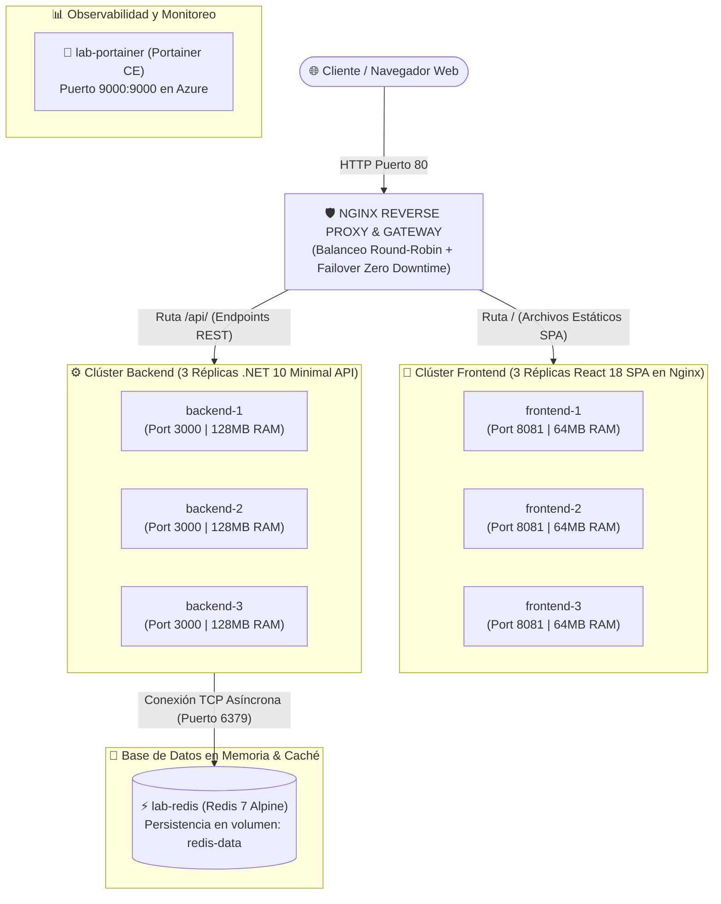
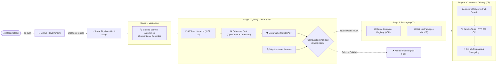

# 🚀 Clúster de Microservicios, Redis y DevSecOps Lab
### UTN FRRe | DevOps – Cultura, Herramientas y Procesos | Ciclo Lectivo 2026

[-brightgreen?style=flat&logo=googlechrome&logoColor=white)](http://devops-maxivalenzano.com)
[-red?style=flat&logo=markdown&logoColor=white)](INFORME_TP1.md)
[-059669?style=flat&logo=portainer&logoColor=white)](http://devops-maxivalenzano.com:9000)
[](https://dev.azure.com/maxivalenzano/DevOps/_build/latest?definitionId=1&branchName=devel)
[](https://sonarcloud.io/summary/new_code?id=maxivalenzano_DevOps)
[](https://sonarcloud.io/summary/new_code?id=maxivalenzano_DevOps)
[](https://sonarcloud.io/summary/new_code?id=maxivalenzano_DevOps)
[](https://sonarcloud.io/summary/new_code?id=maxivalenzano_DevOps)
[](https://github.com/maxivalenzano/dev-ops-clase-2/releases)
[](backend/)
[](frontend/)
[](compose.yaml)
[](nginx/)

---

## 🌟 Accesos Rápidos en Vivo

* 🌐 **Aplicación Web en Producción**: [http://devops-maxivalenzano.com](http://devops-maxivalenzano.com) *(IP directa: `http://68.211.137.116`)*
* 🐳 **Gestor Visual de Contenedores (Portainer CE)**: [http://devops-maxivalenzano.com:9000](http://devops-maxivalenzano.com:9000)
* 📄 **Informe Académico Formal del TP 1**: [INFORME_TP1.md](INFORME_TP1.md)
* 🛡️ **Dashboard de Calidad y Seguridad**: [SonarQube Cloud](https://sonarcloud.io/summary/new_code?id=maxivalenzano_DevOps)
* 📚 **Documentación Técnica y Bitácora**: [VitePress Docs](docs/)

---

## 🗺️ 1. Mapa Conceptual de la Arquitectura (Primer Pantallazo)

El siguiente diagrama ilustra cómo interactúan el cliente, el gateway Nginx, el clúster de frontend, el clúster de backend y la persistencia centralizada en Redis:



---

## 🏛️ 2. Resumen del Clúster (8 Contenedores en Red Aislada)

Tanto en local como en la nube pública de Azure se despliegan **8 contenedores interconectados** mediante la red bridge `lab-network`:

| Contenedor | Rol en el Sistema | Tecnología | Puerto Interno | Límites de Recursos |
| :--- | :--- | :--- | :---: | :---: |
| **`lab-nginx`** | Gateway, Proxy Reverso y Balanceador L7 | Nginx Alpine | `80:80` (Público) | Sin límite |
| **`lab-frontend-1`** | Réplica 1 de la Interfaz Web SPA | React 18 / Vite / Nginx | `8081` | 0.25 CPU / 64 MB RAM |
| **`lab-frontend-2`** | Réplica 2 de la Interfaz Web SPA | React 18 / Vite / Nginx | `8081` | 0.25 CPU / 64 MB RAM |
| **`lab-frontend-3`** | Réplica 3 de la Interfaz Web SPA | React 18 / Vite / Nginx | `8081` | 0.25 CPU / 64 MB RAM |
| **`lab-backend-1`** | Réplica 1 de la API REST (`backend-dotnet-1`) | .NET 10 C# Minimal API | `3000` | 0.50 CPU / 128 MB RAM |
| **`lab-backend-2`** | Réplica 2 de la API REST (`backend-dotnet-2`) | .NET 10 C# Minimal API | `3000` | 0.50 CPU / 128 MB RAM |
| **`lab-backend-3`** | Réplica 3 de la API REST (`backend-dotnet-3`) | .NET 10 C# Minimal API | `3000` | 0.50 CPU / 128 MB RAM |
| **`lab-redis`** | Almacén de Estado en Memoria (Persistente) | Redis 7 Alpine | `6379` | Volumen `redis-data` |
| **`lab-portainer`** | Panel Gráfico de Gestión de Contenedores | Portainer CE | `9000:9000` (Público) | Volumen `portainer-data` |

> 🔒 **Seguridad de Capas:** Redis no expone puertos a Internet. Únicamente los contenedores backend dentro de la red interna tienen acceso para lectura y escritura.

---

## 🖥️ 3. ¿Cómo Usar la Aplicación en la Web? (Guía Paso a Paso)

Ingresando a **[http://devops-maxivalenzano.com](http://devops-maxivalenzano.com)** encontrarás dos modos principales accesibles desde la barra superior:

### 📋 Modo 1: Tablero Distribuido sobre Redis ("Node Signature Board")

Este módulo gestiona tareas en tiempo real demostrando cómo múltiples nodos backend comparten el mismo estado centralizado en Redis sin perder datos.

```text
┌────────────────────────────────────────────────────────────────────────┐
│  🟢 Frontend Node: frontend-react-2   |   🔄 Última lectura: backend-dotnet-1  │
├────────────────────────────────────────────────────────────────────────┤
│  [ Escribe una nueva tarea... ]   [ + Guardar en Clúster ]             │
│                                                                        │
│  Tareas en Redis (3):                                                  │
│  [x] Configurar Nginx Reverse Proxy      🏷️ Creado por: backend-dotnet-1 │
│  [ ] Validar Failover con docker stop    🏷️ Creado por: backend-dotnet-3 │
│  [ ] Pruebas SAST con SonarQube Cloud    🏷️ Creado por: backend-dotnet-2 │
└────────────────────────────────────────────────────────────────────────┘
```

1. **Crear una Tarea:**
   * Escribe un título en el campo de texto y haz clic en **Guardar en Clúster**.
   * Nginx balanceará la petición a uno de los 3 nodos backend (`POST /api/tasks`).
   * Verás que la tarjeta creada tiene un **badge de color único** con el nombre del nodo que la estampó (`createdByNode: backend-dotnet-X`).
2. **Consultar y Actualizar:**
   * Al recargar la página (F5), Nginx balanceará la lectura (`GET /api/tasks`) a otro nodo.
   * El banner superior te indicará en vivo: **"Última lectura atendida por: [Nodo]"**.
   * Todas las tareas se muestran juntas porque la fuente de verdad es **Redis**.
3. **Completar o Eliminar:**
   * Haz clic en el checkbox para tachar una tarea (`PUT /api/tasks/{id}/toggle`) o en el cesto de basura para borrarla (`DELETE /api/tasks/{id}`).
4. **🔥 Prueba de Resiliencia en Vivo:**
   * Apaga un nodo backend en la consola: `docker compose stop backend-1`.
   * Continúa creando y listando tareas en la web: **el sistema sigue respondiendo al 100% sin caídas**, ya que `backend-2` y `backend-3` absorben la carga de inmediato.

---

### ⚡ Modo 2: Laboratorio de Caos y Métricas ("ChaosLab")

Haz clic en la pestaña **Laboratorio de Caos** para probar la robustez de Nginx y los límites de los contenedores:

| Experimento | ¿Qué hace? | ¿Cómo probarlo en la Web? | Resultado Esperado |
| :--- | :--- | :--- | :--- |
| **⚖️ Balanceo de Carga** | Envía ráfagas concurrentes a la API. | Configura `50` peticiones y pulsa **Lanzar Prueba**. | El gráfico de barras muestra la distribución equitativa de peticiones (~33% a cada backend). |
| **⏱️ Timeout de Gateway** | Simula demoras deliberadas en la respuesta. | Selecciona **6000 ms (6s)** y pulsa **Enviar Request**. | Nginx corta la conexión a los 5s y muestra un error JSON estructurado **504 Gateway Timeout**. |
| **💾 Límite OOM (Memoria)** | Fuerza al backend a reservar memoria física. | Haz clic reiteradas veces en **Fugar 50MB RAM**. | Al pasar los 128MB, el kernel ejecuta el **OOM Killer (Exit Code 137)**. Nginx conmuta al nodo hermano sin error visible. |
| **🔥 Estrés de CPU** | Bucle de cómputo intensivo no bloqueante. | Haz clic en **Estresar CPU (3000ms)**. | Mide el tiempo de respuesta y la estabilidad del proceso bajo carga de cálculo. |
| **🩺 Toggle de Salud** | Simula que un backend se declara enfermo. | Haz clic en **Alternar Salud (UP/DOWN)**. | El nodo responde con código `500`. Nginx detecta el fallo y reenvía la petición al siguiente nodo sano de forma transparente. |

---

## 🔄 4. Mapa Conceptual del Pipeline CI/CD & DevSecOps

El pipeline automatizado en **Azure DevOps** (`azure-pipelines.yml`) consta de **4 etapas (Stages)** diseñadas bajo el principio **Fail-Fast**:



* **Stage 1 (Versioning):** Analiza el historial de commits y calcula la versión semántica `MAJOR.MINOR.PATCH` (`SEMVER_TAG`).
* **Stage 2 (Quality Gate & SAST):**
  * Ejecuta **42 pruebas unitarias en .NET 10** usando xUnit y Moq.
  * Evalúa el **Quality Gate en SonarQube Cloud**: si no cumple el estándar de seguridad o cobertura, el build se detiene inmediatamente.
  * Audita imágenes y dependencias con **Trivy Scanner**.
* **Stage 3 (Packaging):** Compila imágenes Docker multi-stage optimizadas y las publica simultáneamente en **Azure Container Registry (ACR)** y **GitHub Container Registry (GHCR)** con tags inmutables.
* **Stage 4 (Continuous Deployment):** Un agente *pull-based* en la VM de Azure descarga las imágenes, recrea los contenedores con Docker Compose, reinicia Nginx para sincronizar el DNS, ejecuta Smoke Tests y publica el Release oficial en GitHub.

---

## ⚡ 5. Cómo Ejecutar el Proyecto en Local

### Prerrequisitos
* [Docker Desktop](https://www.docker.com/) o [Podman Desktop](https://podman-desktop.io/) con Compose instalado.
* [.NET 10 SDK](https://dotnet.microsoft.com/) (opcional, solo para compilar el backend sin contenedor).
* [Node.js 20+](https://nodejs.org/) (opcional, solo para desarrollo frontend local).

### Opción A: Levantar todo con Docker Compose o Podman Compose (Recomendado)

En la raíz del proyecto, ejecuta un solo comando:

```bash
# Construir y levantar los 8 contenedores en segundo plano
docker compose up --build -d

# Si usas Podman:
podman compose up --build -d
```

Verifica el estado de los contenedores:
```bash
docker compose ps
```

Abre tu navegador en:
* **Aplicación Web**: `http://localhost` (o `http://localhost:8080`)
* **Portainer CE**: `http://localhost:9000`

Para detener el clúster:
```bash
docker compose down
```

---

### Opción B: Ejecución en Podman Pod (Red Compartida `localhost`)

Podman permite agrupar contenedores dentro de un **Pod** nativo de Linux (compartiendo namespace de red, exactamente como en Kubernetes):

* **En Windows (PowerShell):**
  ```powershell
  .\scripts\run-pod.ps1
  ```
* **En Linux / macOS / WSL (Bash):**
  ```bash
  chmod +x ./scripts/run-pod.sh
  ./scripts/run-pod.sh
  ```

---

## 🧪 6. Ejecución de Pruebas Unitarias

El proyecto cuenta con una suite automatizada de **42 pruebas unitarias** que validan modelos de dominio, validaciones de entrada, persistencia simulada con mocks de Redis (`Moq`), endpoints de salud y escenarios de caos.

Para ejecutarlas localmente:

```bash
dotnet test tests/Backend.Tests/Backend.Tests.csproj
```

**Salida esperada:**
```text
Passed!  - Failed: 0, Passed: 42, Skipped: 0, Total: 42, Duration: 15 s
```

---

## 📚 7. Documentación Técnica y Bitácora del Proyecto

El repositorio cuenta con un sitio web de documentación integral generado con **VitePress**:

```bash
# Iniciar servidor local de documentación con hot-reload
npm run docs:dev

# Compilar documentación para producción
npm run docs:build
```

---

## 👥 Datos Académicos

* **Asignatura:** DevOps – Cultura, Herramientas y Procesos (Ciclo 2026)
* **Institución:** Universidad Tecnológica Nacional – Facultad Regional Resistencia (UTN FRRe)
* **Docente:** Prof. Ing. Jose A. Fernandez
* **Estudiante:** Maximiliano Nicolas Valenzano (Legajo: 21664)
* **Informe Completo para Evaluación:** [INFORME_TP1.md](INFORME_TP1.md)
